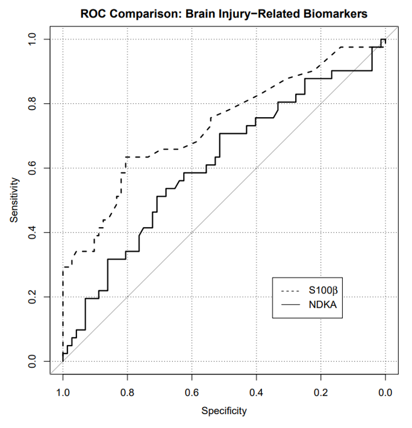

::: callout-important
This homework is due on Thursday, September 10 at 11:59pm. To be considered on time, the following must be done by the due date:

- Final `.pdf` file submitted on Gradescope

Be sure to **assign questions to pages** when you turn in your assignment on Gradescope. A .5 point deduction will be made any time the question is not assigned to a page within your PDF. 

Assign the Formatting portion to page 1.

:::

## Starting a new Quarto file

For this assignment you will begin a new Quarto file. To do this, go to RStudio and click File > New File > Quarto Document. A pop-up will appear asking for a title, author, and format. You may leave these as the default options for now. Click OK and a new file will open. 

In the document, Quarto automatically adds some starter text and code chunks. You may delete everything below the YAML header (everything under the second set of `---`). You should be left with just a YAML section at the very top, which looks something like this:

```{r}
#| eval: false

---
title: "Document Title"
author: "Your Name"
date: "2026-08-26"
format: html
---

```

Now, Edit the YAML header. Change

- title -> the assignment name (e.g. `HW 2`)

- author -> your name

- date -> today's date

Now, save your file. Go to File > Save as, and name it something clear like `hw2.qmd`. Keep it in your project folder. You're ready to begin!

## Exercise 1: SEER Data

According to data from the Surveillance, Epidemiology, and End Results (SEER) Program of the National Cancer Institute, U.S. women have approximately a 1 in 8 lifetime chance (12.5%) of developing breast cancer.

In parts (a)-(c) below, please provide a numerical answer by using R’s calculator capability (i.e., insert new R chunks, show code calculating the numeric answers). Be careful with parentheses! In addition, provide a 1-sentence explanation of your work. A numerical answer using R's calculator is not needed for part (d) - simply provide your response and a 1-sentence explanation. 


a. Suppose three unrelated women are randomly selected from the U.S. population. What is the probability that all three will develop breast cancer at some point during their lives?

b. Suppose three unrelated women are randomly selected from the U.S. population. What is the probability that none of them will develop breast cancer at some point during their lives?

c. Suppose three unrelated women are randomly selected from the U.S. population. What is the probability that at least one of them will develop breast cancer at some point during their lives?

d. A woman with a first-degree female relative with breast cancer has about twice the probability of developing breast cancer during her lifetime compared to a woman without this family history of cancer. Let $A$ be the event that a woman develops breast cancer during her lifetime, and $B$ be the event that a woman has positive family history of breast cancer. Are $A$ and $B$ independent events? Why or why not?


## Exercise 2: Chicken Pox Data

Suppose a chicken pox outbreak hits a population of unvaccinated children. Researchers collect the following data among randomly sampled households with two unvaccinated children. In 50% of such families, the older sibling has chicken pox, in 50% of families, the younger sibling has chicken pox, and in 35% of families, both children have chicken pox.

In (a)-(c) below, please provide a numerical answer by using R’s calculator capability (i.e., insert new R chunks, show code calculating the numeric answers). Be careful with parentheses!

a. Consider two events, $A$ being that the older sibling has chicken pox, and $B$ being that the younger sibling has chicken pox. Are $A$ and $B$ independent events? Explain using the data provided.

b. Consider a randomly selected household with two unvaccinated children from this population. Given that the older sibling has chicken pox, what is the probability that the younger sibling also has chicken pox?

c. Consider a randomly selected household with two unvaccinated children from this population. Given that the older sibling has chicken pox, what is the probability that the younger sibling does NOT have chicken pox?


## Exercise 3

A new rapid antigen test has been developed to detect **Group A Streptococcus (strep throat) infection**. A study compares the results of the rapid test against the gold standard throat culture. The results from 250 patients are shown below:

|                         | Culture Positive | Culture Negative | Total |
|-------------------------|:-----------------:|:-----------------:|:-----:|
| **Rapid Test Positive** | 85                 | 15                 | 100   |
| **Rapid Test Negative** | 15                 | 135                | 150   |
| **Total**               | 100                | 150                | 250   |

a. Calculate the **sensitivity** of the rapid test using the definition of conditional probability. (Leave as an expression.)

b. Calculate the **specificity** of the rapid test using the definition of conditional probability. (Leave as an expression.)

c. In one sentence, explain what specificity means in this context.


## Exercise 4: ROC Curve

An **ROC curve** is a graphical plot that illustrates the sensitivity and specificity of a dichotomous diagnostic test as its discrimination threshold varies. The plot below shows the ROC curve for two different brain injury-related biomarkers, NDKA and S100β, in determining whether a patient develops bad outcomes at the one-year mark.

{width="400"}

Based on the ROC curve, answer (a)-(b) below. 

a. Suppose we are willing to accept a false positive rate of at most 10%. What true positive rates can we attain for NDKA with that stipulation? Justify your answer by referencing the plot.

b. Which biomarker, NDKA or S100β, would you rather use to predict bad outcomes? Why? (For this question, do NOT use the phrase “area under the curve”)


## AI Attestation

If you used AI for this assignment, list your prompts below. Cite any other online resources you used. If you did not use AI for this assignment, you may simply state "I did not use AI for this assignment."

## Submission

As you’ve seen previously, we can **Render** into an .html file that can be opened by any web browser. To export it as a .pdf, open the file in your web browser and then print to or save as a .pdf document. Contact your TAs in Ed Discussion if you need help! 

You will submit the PDF documents for labs and homework to Gradescope as part of your final submission.

To submit your assignment:

- Access Gradescope through the menu on the BIOS 600 Canvas site.

- Click on the assignment, and you’ll be prompted to submit it.

- Mark the pages associated with each exercise. All of the pages of your lab should be associated with at least one question (i.e., should be “checked”).

- Select the first page of your .PDF submission to be associated with the "Formatting" section.

## Grading

| Component | Points |
|----------|--------|
| Ex 1 | 4 |
| Ex 2 | 3 |
| Ex 3 | 3 |
| Ex 4 | 3 |
| Formatting | 3 |

The “Formatting” grade is to assess the document format. This includes having a neatly organized document (no excessive output, warnings/messages when loading packages and/or data) with readable code and your name and the date updated in the YAML.


