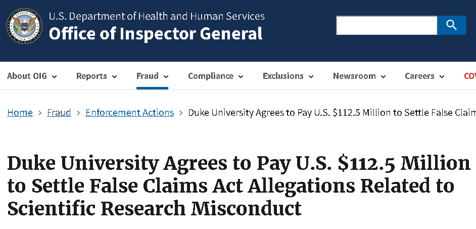

```{r}
#| include: false
library(countdown)
```

<!--# Could add 15 min of something to end of today's lec-->

<!--# Maybe combine with Day 1 lecture?-->

## Download or print notes to PDF {.smaller}

 

If you’d like to export this presentation to a PDF, do the following:

 

1.  Toggle into Print View using the E key.

2.  Open the in-browser print dialog (CTRL/CMD+P)

3.  Change the Destination to Save as PDF.

4.  Change the Layout to Landscape.

5.  Change the Margins to None.

6.  Enable the Background graphics option.

7.  Click Save.


This feature has been confirmed to work in Google Chrome and Firefox.

## Announcements

- Lab 1 due **tomorrow at 11:59pm** in Gradescope. 

- When turning in assignments, be sure to **assign each question to the corresponding page** in your PDF document.

- I will be available for an extra Office Hour session tomorrow, Friday 8/21, from **10am-10:30am via zoom** (link in Modules > Zoom Link for Office Hours). Reach out to the teaching team if you need help installing R/RStudio!

- Fill out the Getting to Know You Survey (linked on Canvas homepage) by **tomorrow at 11:59pm**. 

## Outline

- Quick review from lab 1

- What is (bio)statistical inference?

- Identifying the population of interest

- Sampling types and biases

- Reproducibility crisis: falsifying data

- Biostatistics for public good!

## Review from lab

1. What does `getwd()` do?

2. What does this code do?

```{r}
#| echo: true
#| eval: false
cdc <- read.csv("https://karamccor.github.io/b6002/labs/data/cdc_cleaned.csv")
```

3. What is the difference between R and RStudio?

```{r}
countdown(minutes = 4)
```

## What is statistical inference?

A process that converts data into useful information, whereby practitioners

1.  form a question of interest
2.  collect and summarize data
3.  and interpret the results

## Identifying the population and question of interest 

The **population** is the group we'd like to learn something about:

-   What is the prevalence of diabetes among **U.S. adults**, and has it changed over time?

-   Is there a relationship between tumor type and five-year mortality in **breast cancer patients**?

-   Does the average amount of caffeine vary by vendor in **12 oz cups of coffee at UNC coffee shops**?


## Sampling from the population

If we had data from every unit in the population, we could just calculate what we wanted and be done!

Unfortunately, we (usually) have to settle with a **sample** from the population.

-   Ideally, the sample is **representative**, allowing us to use **probability and statistical inference** to make conclusions that are **generalizable** to the broader population of interest.

## Example: Sleep Data {.smaller}

Researchers wanted to know the average number of hours UNC undergraduates sleep per night, so they surveyed 200 students who were in the campus gym at 6am. The sample averaged 5.1 hours of sleep per night.

Get in groups of 3 and discuss the following:

- What is our population? 

- What is our sample? 

- What does our sample show? Do we think it's representative of our population? Why or why not? 

- What limitations might we have? (How could we improve?)

**Reporter**: Person who's first name is first alphabetically, be prepared to share out

```{r}
countdown(minutes = 4, seconds = 0)
```


## Sampling methods

<!--# Add an example of cluster, multi-stage based on OI book-->

**Probability sampling** (e.g., simple random sampling, stratified, cluster, or multi-stage sampling)

-   All units have a known chance of being selected

-   More likely to be generalizable

-   Can be more expensive and time-consuming

## Sampling methods

**Non-probability sampling** (e.g. quota, convenience, or snowball sampling)

-   Some units unable to be selected, with no way of knowing size or effect of sampling errors

-   Less generalizable to population of interest

-   More convenient and less costly

## Study design

**Experimental** studies (e.g. randomized control trials (RCTs))

-   Researchers directly control exposures or treatment groups. 

-   Ability to make causal statements

-   Less real-world applicability and generalizability

**Observational** studies (e.g. surveys)

-   Researchers do not assign exposures or treatments

-   Real-world setting with lower burden on participants

-   Inability to prove causality

## Example {.smaller}

- Study: The effect of a new diet on weight loss in adults

- Objective: To determine whether a new low-carbohydrate diet leads to significant weight loss compared to a standard diet in adults. 

- Study Design: 
  - Participants: 100 adults aged 25-45 with a BMI between 25 and 30
  - Randomization: Participants are randomly assigned to one of two groups: 
    - Group A: 50 participants following the new low-carb diet
    - Group B: 50 participants following a standard diet.
  - Intervention: Group A follows the new diet for 12 weeks, while Group B follows their usual diet (standard diet)
  - Outcome measurement: Weight of participants is measured before the study begins and after 12 weeks. 

## Example


In groups of 3, discuss the following:

- Is this study an observational or experimental study? Why?

```{r}
countdown(minutes = 2)
```


## What can go wrong? {.smaller}

- Depending on the study design and sampling methods, different types of bias occur (again, we don't have the full population, only a sample). 

- Examples include: 
  - Selection bias: sample does not accurately reflect target population
  - Reporting bias: tendency to under-report all information available
  - Many more: non-response bias, attrition bias, confounding, detection bias, lack of blinding, straight-up falsified data (this happens), ...

 [and more!](https://catalogofbias.org/biases/)

## A few years ago...


[link to article](https://pubmed.ncbi.nlm.nih.gov/33615345/)

## Article (continued)

- seroprevalence = level of pathogen in a population

- From Conclusion: "The estimated prevalence of SARS-CoV-2 antibodies in Santa Clara County implies that COVID-19 was likely more widespread than indicated by the number of cases in late March, 2020". 

## However...

{width="300"}

[What do some other people have to say about this study...?](https://medium.com/@balajis/peer-review-of-covid-19-antibody-seroprevalence-in-santa-clara-county-california-1f6382258c25)


## Three main issues brought up in blog

1. Sampling bias

- Recruited through Facebook ads, may have attracted people more concerned about COVID-19 or those who thought they were already exposed $\rightarrow$ overestimation of seroprevalence

  - Symptomatic/exposed individuals may have signed up to get tested, especially when testing was limited. 
  
  - Participants may have recruited others in their network

- Without a truly random sample, findings are less generalizable and reproducible

## The issues, continued 

2. Statistical adjustments: High false positive (FP) rate could drive results

- Study had high FP rate (2 FP out of 401 known negative samples, about 0.5%), but w/ a wide confidence interval! (FP Rate could be above 1.2%)

- Reported only 50 positives out of ~3300 participants, so such a high FP rate could account for a significant portion - if not all - of the positive results. ($\frac{2}{401}\cdot 3300 = 17$) Yikes!

- Could be more! (re-calibrate assay on different set of 401 known negative samples, may get 0/401 FP or even 6/401). 

## The issues, continued

3. Transparency

- Study does not make its raw data, code, and full methodology publicly available

- Without access to these, other researchers cannot replicate the study or verify its findings, undermining the reproducibility of the research

- Transparency essential for the scientific process (particularly in high-stakes studies!)

## Reproducibility and replicability

-   **Reproducibility**: being able to take original data and code to reproduce all numerical findings.

-   **Replicability**: being able to independently repeat an entire study without use of the original data (generally with the same methods)

## Your turn

Consider the following 2 examples. 

For each example: Is this a demonstration of reproducibility or replicability?

## Example 1

A researcher publishes a study finding that a new blood pressure drug lowers systolic BP by an average of 8 mmHg (p = 0.03), based on data from 500 patients. They post the raw dataset and their R script on a public repository.

You download the dataset and run their exact script. It re-runs the same t-test on the same data and outputs the same 8 mmHg difference and the same p = 0.03.

## Example 2

A different research group, in a different city, is skeptical of that drug's effect. They don't touch the original dataset at all. Instead, they design their own trial — similar patient population, same dosage protocol, same outcome measure (systolic BP) — recruit 500 new patients, collect fresh data, and run the analysis.

They find the drug lowers systolic BP by 7.5 mmHg (p = 0.04) in their independent sample.

## Best practices 

From the American Statistical Association:

-   End-to-end scripting of research

  - From the moment you "read in" your raw data, document the code you used for data cleaning, visualization, and analysis
-   Use of version control and documentation (we will not use this in our class)
-   Publication of code along with data

## The current replication crisis

::: columns
::: {.column width="50%"}
{fig-alt="Former Harvard stem cell researcher up to 18 retractions" fig-align="center" width="350"}

- misconduct, including image manipulation

:::

::: {.column width="50%"}
{fig-alt="Duke agrees to pay $112 million to settle false claims related to scientific misconduct" fig-align="center" width="350"}

- submitting falsified data to secure federal research grants
:::
:::

Fraudulent data can lead to unreliable research findings, waste resources, and erode trust in scientific integrity!

## What is biostatistics good for?

- Turning data into insight 

- Evaluating interventions 

- Promoting health equity

- Forecasting & prevention 

- Improving patient care 


## What is biostatistics good for?

- When we appropriately apply statistical inference methods, they can do a lot of good!

{width="300"}


## What is biostatistics good for?

{width="300"}

## What is biostatistics good for?

{width="300"}


## In this course, we will...

-   Apply descriptive techniques commonly used to summarize public health data.
-   Learn methods to analyze real-world data to answer research questions in a biomedical setting.
-   Use [Quarto](https://quarto.org/) within RStudio to write reproducible reports.
    - Reading in data, cleaning data, visualization, analysis, interpretation
-   Communicate results from statistical analyses to a general audience.

## Recap

- What is (bio)statistical inference?

- Identifying the population of interest

- Sampling types and biases

- Reproducibility crisis: falsifying data

- Biostatistics for public good!

## Next class

- The nature of data
