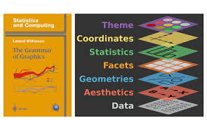
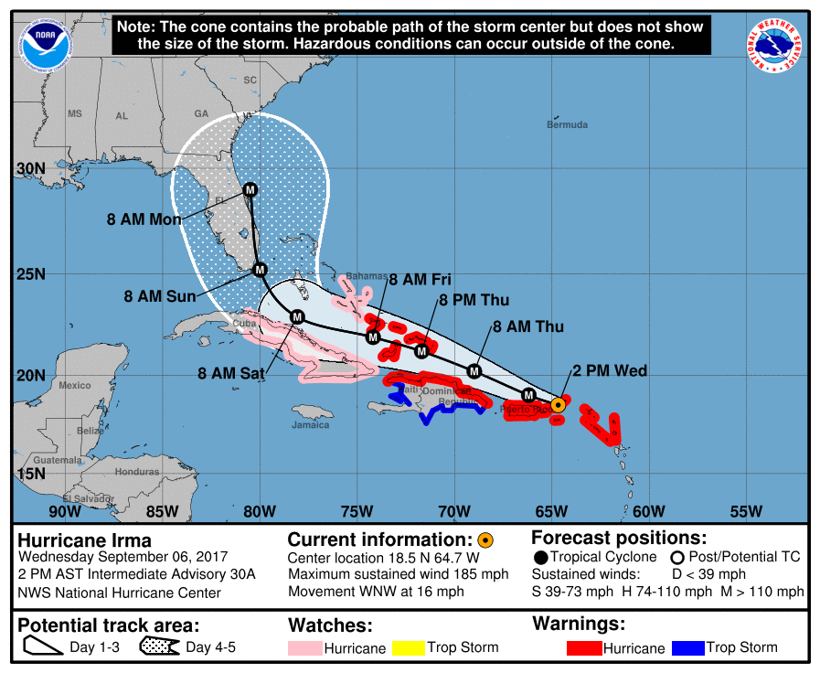
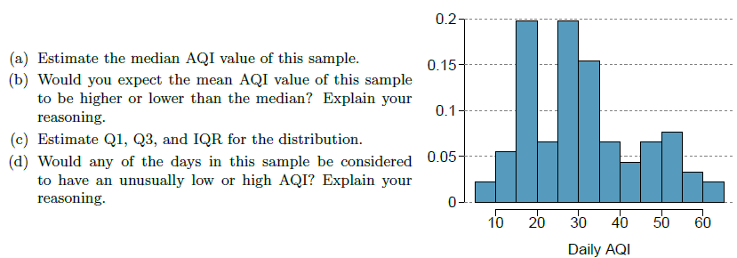

<!--# Take 10 min off today's lec (maybe remove extra stuff on outliers)-->

```{r}
#| warning: false
library(tidyverse)
library(countdown)
library(openintro)
```

## Reading

- [OpenIntro Statistics](https://www.openintro.org/go/?id=os4_for_screen_readers&referrer=/book/os/index.php): Sections 2.1, 2.2

## Announcements

- Lab 2 today at 3:30pm. Lab 2 due this Friday at 11:59pm.

- HW 1 will be released later today. HW 1 due Tuesday 9/1 at 11:59pm.

# Survey results

## Interests

- Wide range of academic interests

- Public health, epidemiology, health policy, biology, machine learning, climate change, nutrition, exercise science, pre-med, pre-dental, food access, rural health, & many more!

## Experience with R

Scale 1-5: 1 = minimal/no experience, 5 = solid experience

- 51% have never used R before or have minimal experience

- 27% rated themselves (2) on the scale

- ~21% rated themselves 3 or 4, basic proficiency

## Hopes

- Getting more comfortable coding in R, data visualization/analysis

- Learning foundational skills in statistics and coding

- Learn more about how biostatistics can be applied towards public health

- Practicing communicating statistical results to a general audience

## Supplemental resources

- Reading sections for each lecture are in the syllabus!

- For audio/visual learners: [https://openintro.org/book/os/](https://openintro.org/book/os/) > Videos has short video lectures about each section in the book.

- Later today, I'll post some online interactive R tutorials in this week's Module.

# Thanks for filling out the survey!

## Outline

- Review from last time

- Visualizing data, using ggplot2

- Types of data, types of plots

- Best practices for data visualization

- Numerical summary statistics, measures of uncertainty

## Review from last time

::: {.callout-tip}

## Populations and samples

Consider the following research questions:

1. What is the average mercury content in swordfish in the Atlantic Ocean?
2. Over the last five years, what is the average time to complete a degree for UNC undergrads?
3. Does a new drug reduce the number of deaths in patients with severe heart disease?

In small groups, identify the target population and what represents an individual case for each of the questions above. 
:::

```{r}
countdown(minutes = 2)
```


## Exploratory data analysis (EDA)

-   Initial data analysis approach that summarizes main characteristics of dataset
-   Often visual or in the form of basic summary statistics

## Data visualization

-   The creation and study of the visual representation of data
-   Many tools available (R is popular; many systems within R for data visualization)
-   Creating visualizations helps us see patterns and identify potential data quality issues
-   We will focus on **ggplot2**, a component of the **tidyverse**


::: {.callout-note appearance="minimal"}
"The simple graph has brought more information to the data analyst's mind than any other device." - John Tukey
:::


## ggplot2 in tidyverse

::: columns
::: {.column width="50%"}
-   The tidyverse is a group of R packages designed for data science
-   All tidyverse packages share an underlying design philosophy
-   Data visualization package in the tidyverse
-   Inspired by *The Grammar of Graphics* (Wilkinson)


:::

::: {.column width="50%"}

:::
:::

## What is a Grammar of Graphics?

-   A system allowing for concise description of graphical components

{width="300"}

## What is a Grammar of Graphics?

A statistical graphic is

-   data (which may be statistically summarized or transformed)
-   **mapped** to **aesthetic** attributes (color, size, xy-position, etc.)
-   using **geometries** (points, lines, bars, etc.)
-   mapped onto a specific **coordinate** and/or **facet** system

# Types of data

## Categorical data

::: columns
::: {.column width="50%"}
**Nominal data**

-   Named categories without numeric meaning
-   Ex: Only two categories: binary or dichotomous
-   Ex: breast cancer status, blood type, health insurance provider type, etc.
:::

::: {.column width="50%"}
**Ordinal data**

-   Ordered categories, but differences between values not easily measured
-   Relative comparisons made about differences between levels
-   Stage of colon cancer, Likert scale, frequency of smoking (often, sometimes, rarely, never), etc.
:::
:::

## Numerical data

::: columns
::: {.column width="50%"}
**Count** or **rank data**

-   Discrete counts. Or ranks.
-   Number of alcoholic drinks consumed in the past week, numerical rank of cancers by mortality, etc.
:::

::: {.column width="50%"}
**Continuous data**

-   Measurable quantities where difference between possible values can be arbitrarily small
-   Data may lie within a range or be unbounded
-   Birth weight, BMI, ppm ozone, etc.
:::
:::

## Identifying data types

{width="400"}

## Identifying data types

::: {.callout-tip}
## In small groups, discuss the following:

According to the table on the previous slide, what kind of data types are the following variables?

- Age
- Female
- Education
- Hemoglobin A1c
- Current smoking

:::

Use the convention "Numerical; continuous" or "Categorical; Ordinal", etc.

```{r}
countdown(minutes = 4)
```

## Complications

In designing a study, what variable should we use for smoking exposure?

-   Binary variable yes/no?
-   Ordinal current/former/never smoker?
-   Discrete number of cigarettes smoked in past week?
-   Continuous measurement of lifetime pack-years?

In the real world, decisions are made based on sample size, statistical power, likelihood of measurement error, or simply convenience (this happens a lot!)

## Visualizing CDC data {.small}

Let's take a look at some basic visualizations using state-level data collected by the Center for Disease Control (CDC). We'll examine the following variables:

-   State (categorical; nominal)
-   Human Development Index (HDI) (categorical; ordinal)
    - a composite index that measures a country's average achievements in health, knowledge, and standard of living
-   Region (categorical; nominal)
-   Adult obesity % (numerical; continuous)
-   Adequate aerobic activity % (numerical; continuous)

## Bar charts

```{r}
cdc <- read.csv("https://karamccor.github.io/b6002/labs/data/cdc_cleaned.csv")

# cdc <- read.csv("https://www2.stat.duke.edu/courses/Spring21/sta102.001/labs/data/cdc_cleaned.csv")

# write.csv(cdc, "C:/Users/kmcco/OneDrive - University of North Carolina at Chapel Hill/Documents/UNC_Teaching/fall2024/bios600-f24/labs/data/cdc_cleaned.csv")
```

::: columns
::: {.column width="50%"}
```{r fig.height = 8, fig.width = 7, fig.asp=1}
ggplot(data = cdc, mapping = aes(x = Region)) + 
  geom_bar(fill = "steelblue") + 
  labs(title = "Number of US States by Census Region", 
       x = "Region", y = "Count") + 
  theme(text = element_text(size = 18))
```
:::

::: {.column width="50%" style="font-size: 70%;"}
-   Summarizes numerical variable by categories
-   Visually depict frequency distributions for nominal or ordinal data
-   Bars represent either frequency or relative frequency by category
-   Separation between bars (non-continuous data)
-   May contain error bars to indicate estimate variability
:::
:::

## Box plots

::: columns
::: {.column width="50%"}
```{r fig.height = 8, fig.width = 7, fig.asp=1}
ggplot(data = cdc, aes(x = HDI, y = Obesity)) + geom_boxplot()+ 
  labs(title = "Adult Obesity (%) by State HDI", 
       x = "HDI", y = "Adult Obesity (%)") +
  theme(text = element_text(size = 18))
```
:::

::: {.column width="50%" style="font-size: 85%;"}
-   Summarizes numerical variable
-   Five-number summary: sample minimum, 25th percentile, median, 75th percentile, sample maximum
-   Outliers
-   Spread and skew
-   (More on all these later!)
:::
:::

## Histograms

::: columns
::: {.column width="50%"}
```{r fig.height = 8, fig.width = 7, fig.asp=1}
ggplot(data = cdc, aes(x = Obesity)) +
  geom_histogram(color = "darkblue", fill = "lightblue", binwidth = 2)+ 
  labs(title = "Distribution of Adult Obesity (%) by State", 
       x = "Adult Obesity (%)", y = "Count") +
  theme(text = element_text(size = 18))
```
:::

::: {.column width="50%" style="font-size: 85%;"}
-   Summarizes numerical variable
-   Frequency distribution for discrete or continuous numerical data
-   Outliers
-   Each bar is proportional to the frequency of the categories
:::
:::

## Line plots

::: columns
::: {.column width="50%"}
```{r fig.height = 8, fig.width = 7, fig.asp=1}
ggplot(data = cdc[1:4,], aes(x = State, y = Obesity, group = 1)) +
  geom_line() + 
  geom_point() + 
  labs(title = "Obesity by State", 
       x = "State", y = "Adult Obesity (%)")+ 
  theme(text = element_text(size = 28))

```


:::

::: {.column width="50%" style="font-size: 85%;"}
-   Summarizes numerical variable (most often used across time)
-   Each value on x-axis corresponds to only one measurement on y-axis (and vice versa)
-   Often used to depict change over time and connected with line.


::: {.callout-warning title="Question"}
Is this plot useful?
:::


:::
:::

## Scatterplots

::: columns
::: {.column width="50%"}
```{r fig.height = 8, fig.width = 7, fig.asp=1}
cdc |>
  ggplot(aes(x = Exercise, y = Obesity)) +
  geom_point() + 
  facet_grid(. ~ HDI) +
  ggtitle("Adequate aerobic activity \n associated with lower obesity") +
  xlab("Adequate aerobic activity (%)") + 
  theme(text = element_text(size = 28),
        axis.text = element_text(size = 16))
```
:::

::: {.column width="50%" style="font-size: 85%;"}
-   Shows relationship between multiple continuous measurements

-   You can add color, shape, transparency, etc to further differentiate by category
:::
:::

## Some best practices

-   Keep it simple
-   Summarize and highlight
-   Tell a story with the plot (use "active titles")
-   If possible, replace text with visuals. Think: Is there a succinct, effective way to visually represent the data/trend, instead of writing text about it?

# Statistics terminology for summarizing data

## Example: Pneumonia {.smaller}

{width=300}

-   **Population and research question**: Is the PCV13 vaccine effective against community acquired pneumonia in **adults aged 65 or older**?

-   Sample: 84,496 adults 65 years of age or older recruited in a trial between September 2008 and January 2010 and 101 sites throughout the Netherlands.

## Parameters and statistics 

**Parameters**

-   Attribute of the **population of interest**
-   Not computable directly (unless entire population is perfectly measured)
-   Written in Greek letters (e.g. $\mu$ is often used for population mean)

## Parameters and statistics (continued)

**Statistics**

-   Attribute of a **sample**
-   Function of the observed values at hand
-   Confusingly, both the function and the values
    - "The sample mean" is a statistic, as a concept
    - Also, suppose the average age (i.e. sample mean) of students in this class is 22.5 years. The number "22.5 years" is a statistic.
-   Written in Roman letters (e.g. $\bar {X}$ is often used for sample mean)


## Example 

::: columns
::: {.column width="50%"}
-   Population **parameter** of interest: vaccine efficacy among all adults aged 65 or older

-   Sample **statistic** collected: proportion of vaccinated adults in the trial who became ill with community-acquired pneumonia
:::

::: {.column width="50%"}

:::
:::

# Numerical summary statistics

- 1. Point estimates

- 2. Measures of uncertainty

## Mean {.smaller}

-   **Sample mean**: the arithmetic average of values in the sample:

$$\bar{x} = \frac{1}{n}(x_1 + \ldots + x_n) = \frac{1}{n} \sum_{i=1}^n x_i$$

-   Population mean $\mu$ is calculated the same way, but would involve sum over every observation in the population (rarely possible!)

-   The sample mean is a **point estimate** of the population mean

-   Not the exact population mean (unless lucky), but for a representative sample, it's a pretty good guess

-   As the sample size gets larger, on average $\bar{x}$ gets closer and closer to $\mu$

## Median

-   **Sample median**: the $50^{th}$ **percentile**

-   Middle number of observations after being ranked in numerical order

-   For odd number observations, it is the exact middle value; otherwise, it is the arithmetic average of the middle two.

-   Example: What is the median of $\{3, 4, 5, 5, 7, 8, 9, 9\}$ ?

-   More **robust** to extreme values or outliers when compared to the mean.

## Mode

-   **Sample mode**: the most frequent value in the dataset
-   There does not only have to be one mode (we can have bimodal or trimodal or other **multimodal** distributions)
-   Example: What is the mode of $\{1, 2, 3, 4, 4, 5, 5, 5, 7, 9\}$?

## Are point estimates of location enough?

{width="700"}

## Skewness {.smaller}

```{r out.height="30%"}
# Set the seed for reproducibility
set.seed(123)

# Simulate data from a normal distribution
normal_data <- rnorm(400, mean = 0, sd = 1)

# Transform the data to make it right-skewed
right_skewed_data <- exp(normal_data)

# Create a histogram
hist(right_skewed_data, breaks = 30,
     col = "darkgoldenrod3", main = " ", 
     xlab = "Value")
```

- **Skewed** distributions are not symmetric

- They can be right or left skewed depending on which side the "tail" is on.

## Minimum, maximum, and range

-   **Sample minimum** and **maximum**: the smallest and largest observations in the dataset

-   **Sample range**: the difference between the sample maximum and the sample minimum

## Quantiles

-   Cutpoints dividing the data into equal-sized groups (tertiles, quartiles, quintiles, percentiles, etc.)

-   First quartile (Q1) and third quartile (Q3) cut off the bottom and top 25%, respectively

-   **Interquartile range** (IQR): Q3-Q1; shows the width of the middle 50% of the data

-   The sample minimum, Q1, Q2 (median), Q3, and maximum are sometimes called the **five number summary**

- By default, whiskers in a boxplot extend 1.5 $\times$ IQR. Points outside of this range may be considered "unusually" large/small

## Robust statistics

- The median and IQR are called **robust statistics** because extreme observations have little effect on their values: moving the most extreme value generally has little effect on these statistics.


## Practice

What percent of data fall between Q1 and the median? What percent is between the median and Q3?

```{r}
countdown(minutes = 1)
```

## Outliers

-   Observations numerically distant from others (definitions vary)

-   Statistical methods robust to outliers (e.g. the median) can be used if outliers are problematic

  - For example: the mean of 1, 2, 3, 4, 5, 10 is 4.1667, while the median of the same set of numbers is 3.5. 

-   Should be noted and handled carefully! (e.g. maternal ages of 11 vs 111 in a dataset)

## Outliers

An **outlier** is an observation that appears extreme relative to the rest of the data. 

Examining data for outliers serves many useful purposes, including:

1. Identifying strong skew in the distribution

2. Identifying possible data collection or data entry errors

3. Providing insight into interesting properties of the data

## Participation: Practice with Median and IQR

Daily air quality is measured by the air quality index (AQI) reported by the Environmental Protection Agency. This index reports the pollution level and what associated health effects might
be a concern. The index is calculated for five major air pollutants regulated by the Clean Air Act and takes values from 0 to 300, where a higher value indicates lower air quality. AQI was reported for a sample of 91 days in 2011 in Durham, NC. The relative frequency histogram below shows the distribution of the AQI
values on these days.

## Participation: Practice with Median and IQR



Fill in your answers on today's participation assignment on Canvas.

```{r}
countdown(minutes = 6)
```

## Standard deviation 

-   **Sample standard deviation**: most common measure of spread, based on deviations around the mean

$$s = \sqrt{\frac{1}{n-1} \sum_{i=1}^n (x_i - \bar{x})^2}$$

-   Population SD $\sigma$ is calculated the same way, but requires sum over everyone in the population (with $\bar{x}$ replaced by $\mu$)

## Standard deviation (continued)

-   Same units as original dataset for easier interpretation

-   Often used to express confidence (e.g. a **margin of error** for a poll being around $\pm$ 2 SD of the mean)

-   Squared deviations weight larger deviations more heavily, 

and so also positive and negative deviations do not cancel out

## Variance {.smaller}

-   **Sample variance**: approximately the average squared deviation from the mean

$$s^2 = \frac{1}{n-1} \sum_{i=1}^n(x_i - \bar{x})^2$$

-   Estimate of the population variance $\sigma^2$
-   Division by $n-1$ instead of $n$ is an adjustment to avoid bias in small samples
    -   Don't worry about that right now, more details in a subsequent statistics class if interested

## Spread of values

- You may have heard of the "68-95-99.7" rule. (68% of your data are within 1 SD, 95% are within 2 SD, 99.7% are within 3 SD).

- However, this only works for bell-shaped (normal distribution) data. 

- We have a property that holds for all distributions called the Chebyshev inequality. 

- Chebyshev holds for all distributions - no matter how skewed or irregular!


## How big are most values?

-   For a distribution of any shape, most of the data are within "average $\pm$ $k$ SDs"

::: {.callout-note appearance="minimal"}
## Chebyshev's inequality

-   **Chebyshev's inequality** tells us the proportion of values in the range "average $\pm$ $k$ SDs" is at least $1-\frac{1}{k^2}$
:::

## Chevychev's bounds

|       Range       |              Proportion             |
|:-------------------:|:-------------------------------:|
| Average $\pm$ 2 SDs | at least $1-\frac{1}{4}$ = 75%  |
| Average $\pm$ 3 SDs | at least $1-\frac{1}{9}$ = 89%  |
| Average $\pm$ 4 SDs | at least $1-\frac{1}{16}$ = 94% |
| Average $\pm$ 5 SDs | at least $1-\frac{1}{25}$ = 96% |

-   If we know the exact distribution (coming soon), we can often calculate better bounds

-   However, these bounds hold for *any* distribution (that has a well-defined mean and variance)


## Why not always use means and SDs? {.small}

::: columns
::: {.column width="50%"}
```{r}
set.seed(123)
# Calculate the mean and standard deviation of the right-skewed distribution
mean_skewed <- mean(right_skewed_data)
sd_skewed <- sd(right_skewed_data)

# Simulate a symmetric normal distribution with the same mean and standard deviation
symmetric_normal_data <- rnorm(1000, mean = mean_skewed, sd = sd_skewed)

# Create a histogram of the symmetric normal distribution without axes, axis labels, or main title
hist(right_skewed_data, breaks = 30,
     col = "darkgoldenrod3", main = " ", 
     xlab = "Value")
```
:::

::: {.column width="50%"}
```{r}
hist(symmetric_normal_data, breaks = 30, ann = FALSE, col = "darkgoldenrod3")
```
:::
:::

These two distributions have the same mean and standard deviation, but are clearly very different!

-   Exploratory data analysis can help us visually see differences in two datasets that basic statistics (e.g. mean and sd) might not reveal

## Sneak Peek: Data Transformations

When data are strongly skewed, we sometimes transform them so that they are easier to model. 

The `county` dataset has data for 3142 counties in the United States.

## Sneak Peek: Data Transformations

```{r}
county |>
  ggplot(aes(x = pop2017)) +
  geom_histogram() +
  labs(title = "2017 Populations of all US Counties")
```

What isn't useful about this plot?


## Log-transformed data


```{r}
county |>
  ggplot(aes(x = log10(pop2017))) +
  geom_histogram() +
  labs(title = "Log_10 Transformation of \n 2017 Populations of all US Counties")
```
For this plot, a 4 on the x-axis corresponds to the power of 10, e.g. a "4" on the x-axis corresponds to $10^4 = 10,000$. 


## Recap

-   Exploratory data analysis: initial data analysis that summarizes key aspects of data
-   Types of data: categorical, numerical
-   Examples of plots: bar charts, box plots, histograms, etc.
-   Numerical summary statistics: mean, median, mode
-   Quantiles, outliers, standard deviation vs. variance, Chebyshev's inequality


## Prepare for lab today

- For lab today, you'll need to install the `tidyverse` package. Do so with the following in your Console:

```{r}
#| eval: false
#| echo: true
install.packages("tidyverse")
```

## Next up

- Lab today at 3:30pm

- Thursday's Class: Probability basics

## Exit ticket

Make sure you are part of our Ed Discussion forum before you leave class today. This is where I will post class announcements.