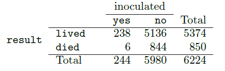

```{r}
library(countdown)
```

## Welcome!

Take 1 piece of paper per 2 people.


## Announcements

- HW 1 Due tonight at 11:59pm

- Lab 3 session Today at 3:30pm, due Friday at 11:59pm

  - Get started early!


## Ensure your code is visible in your PDF document!

- For all assignments

- Go from this:

```{r}
#| eval: false
#| echo: true
ggplot(data = cdc, aes(x = Region, y = InfantMortalityRate)) + 
  geom_boxplot() + labs(title = "Infant Mortality Rate (%) by Region", xlab = "Region", ylab = "Infant Mortality Rate (%)")
```

to this:

```{r}
#| eval: false
#| echo: true
ggplot(data = cdc, aes(x = Region, 
                       y = InfantMortalityRate)) + 
  geom_boxplot() +
  labs(title = "Infant Mortality Rate (%) by Region", 
       xlab = "Region", 
       ylab = "Infant Mortality Rate (%)")
```

## Reading

-   Pagano and Gavreau: Sections 6.2
-   [OpenIntro Statistics](https://www.openintro.org/go/?id=os4_for_screen_readers&referrer=/book/os/index.php): Section 3.2

## Overview

-   Example & visual illustration of probability
-   DeMorgan's Laws
-   Conditional probability
-   Independence and disjoint events

## Example

Consider the experiment of rolling one fair six-sided die.

Let's define the following events: 

- $A$: roll a 3

- $B$: roll an odd number

Let's draw out our experiment visually. 

## Practice

Using your illustration, determine the following:

a) What is the sample space of the experiment? 

b) What is P($A$)?

c) What is P($B$)?

d) What is the probability of $A$ happening, given we know we've rolled an odd number?

## Practice

e) What is P($A^C$) ?

f) List out the events in $A \cup B$. What is P$(A \cup B)$?

g) List out the events in $A \cap B$. What is P$(A \cap B)$?

h) Are the events $A$ and $B$ disjoint?

```{r}
countdown(minutes = 4)
```


## DeMorgan's laws

{width="100"}

-   **Complement of union**: $(A\cup B)^C = A^C \cap B^C$

-   **Complement of intersection**: $(A\cap B)^C = A^C \cup B^C$

## Practice

Verify the **Complement of union** law with our dice example. (Draw it out!)


# Conditional probability

## Conditional probability

- **Conditional probability** is the probability an event will occur when another event has already occurred. 

## Examples

Examples come up all the time in the real world:

-   Given that a mammogram comes back positive, what is the probability that a woman has breast cancer?

-   Given that a 68-year old man has suffered four previous heart attacks, what is the probability he dies in the next five years?

-   Given that a patient has a mutation in the CFTR gene, what is the probability their offspring will have cystic fibrosis?


## Conditional probability

**Definition**: The **conditional probability** of event $A$ given event $B$ is


$$
P(A|B) = \frac{P(A\cap B)}{P(B)}
$$

- How can we represent this visually? (Drawing)

- Takeaway: If we know $B$ has already happened, our sample space effectively shrinks to only events that are contained within $B$.


## The Multiplicative rule

We can rewrite the definition of conditional probability:

$$
P(A|B) = \frac{P(A\cap B)}{P(B)} \implies  \underbrace{P(A\cap B) = P(A | B) \times P(B)}_{\text{Multiplicative Rule}}
$$


::: callout-tip
## Question

What does the multiplicative rule mean in plain English?
:::

- The probability that A and B **both happen** is the probability that B happened, multiplied by the probability of A happened (given B already happened).  

## Independence

Events $A$ and $B$ are said to be **independent** when

::: {.callout-caution appearance="minimal"}

$$
P(A \cap B) = P(A) \times P(B)
$$
:::

or equivalently, $P(A|B) = P(A)$ or $P(B|A) = P(B)$

- In other words, if A and B are independent, then the probability of both happening is simply the probability of A happening times the probability of B happening. (Since B happening has nothing to do with A later happening, or vice-versa).

## Example

- Experiment: Toss a fair 6-sided dice two times. We assume the two tosses are **independent** from each other. 

- Let $A$ = getting a 1 on the first toss. Let $B$ = getting a 1 on the second toss.

- What is $P(A)$?

- What is $P(B)$?

- What is the $P(A \cap B)$?

- What is $P(A | B)$ ?

- What is $P(B | A)$ ?
    

## Recall: disjoint events

- Definition: Two outcomes are **disjoint** or **mutually exclusive** if they cannot both happen. 

- For example: If we roll a die, the outcomes 1 and 2 are disjoint since they cannot both occur. 

- On the other hand, the outcomes 1 and "rolling an odd number" are not disjoint since both occur if the outcome of the roll is a 1. 


## Conditional probabilities and independence {.smaller}

| Coffee drinking | Died? Yes | Died? No | Total |
|-----------------|:---------:|:--------:|:-----:|
| None            |   1039    |   5438   | 6477  |
| Med-Low         |   4440    |  29712   | 29809 |
| High            |   3601    |  24934   | 28535 |
| **Total**       |   9080    |  60084   | 64821 |

What was the probability a randomly selected person in the study...

-   ...died?
-   ...died, given they were a non-coffee drinker?

::: callout-caution
## Question

In this study, were dying and coffee drinking independent events?
:::


## Order matters!

What is the probability that a random person...

| Coffee drinking | Died? Yes | Died? No | Total |
|-----------------|:---------:|:--------:|:-----:|
| None            |   1039    |   5438   | 6477  |
| Med-Low         |   4440    |  29712   | 29809 |
| High            |   3601    |  24934   | 28535 |
| **Total**       |   9080    |  60084   | 64821 |

-   ...was a high coffee drinker, given that they died?

-   ...died, given that they were a high coffee drinker?

Are these two probabilities the same?

## Example: Smallpox

The `smallpox` data set provides a sample of 6,224 individuals from the year 1721 who were exposed to smallpox in Boston. 

Doctors at the time believed that inoculation, which involves
exposing a person to the disease in a controlled form, could reduce the likelihood of death.

## Example: Smallpox

Each case represents one person with two variables: `inoculated` and `result`. The variable `inoculated` takes two levels: `yes` or `no`, indicating whether the person was inoculated or not. The
variable `result` has outcomes `lived` or `died`.



Write out, in formal notation, the probability that a randomly selected person who was not inoculated died from smallpox, and find this probability.

## Solution

$P(\textrm{result = died | inoculated = no})=$

$\frac{P(\textrm{result = died and inoculated = no})}{P(\textrm{inoculated = no})} = \frac{(844/6224)}{(5980/6224)} = .141$

## Exercise

The people of Boston self-selected whether or not to be inoculated. 

(a) Is this study observational or was this an experiment? 

(b) Can we infer any causal connection using these data? 

(c) What are some potential confounding variables that might influence whether someone lived or died and also
affect whether that person was inoculated?

```{r}
countdown(minutes = 2)
```


## Recap

-   Example & visual illustration of probability

-   DeMorgan's Laws

-   Conditional probability

-   Independence and disjoint events


## Next class

- Lecture 5: Medical diagnostics

## Participation

- Name + How was class 
