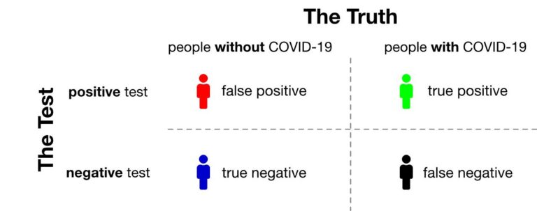
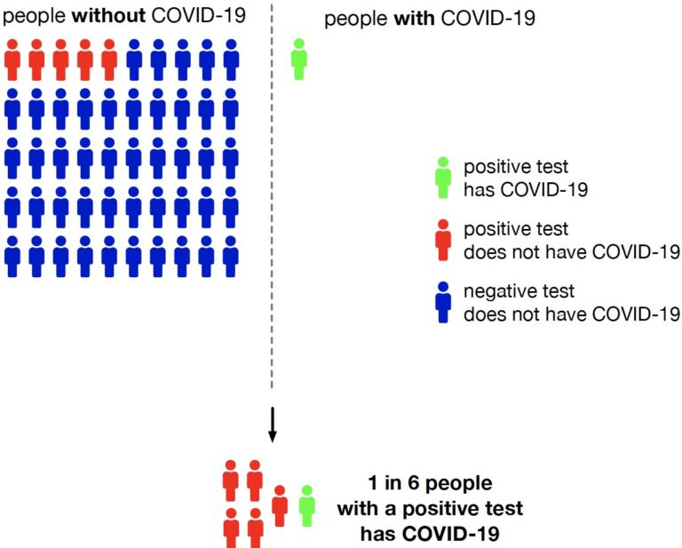

```{r}
#| echo: false
#| warning: false
#| message: false
library(countdown)
library(tidyverse)
```


## Announcements

- Lab 3 Due Friday at 11:59pm

- HW 2 will be assigned after class, due Sept 10 at 11:59pm.

## Reading

-   Pagano and Gavreau: Section 6.4

-   [OpenIntro Statistics](https://www.openintro.org/go/?id=os4_for_screen_readers&referrer=/book/os/index.php): No corresponding section

## Overview

- Review from lab

- Define prevalence, sensitivity, specificity, positive predictive value, negative predictive value

- How conditional probabilities relate to sensitivity, specificity

- Calculate sensitivity and specificity based on a 2x2 contingency table
 
- ROC Curves

# Review from Lab

## Review

Consider the `iris` data set, which gives the measurements in centimeters of the variables sepal length and width and petal length and width, respectively, for 50 flowers from each of 3 species of iris. The species are *Iris setosa*, *versicolor*, and *virginica*.

```{r}
#| echo: true
glimpse(iris)
```
## Participation

**Instructions**: Go to Canvas and find today's participation assignment. Write your answers to the following review questions in the text box. (1 sentence each)

I will assign questions 1-6 to random groups to report their answer after the timer is up.

This assignment is due **tomorrow Friday 9/4 at 11:59pm**.

```{r}
#| echo: false
countdown(minutes = 8)
```


## Review

What would each of the following do?

1. 

```{r}
#| echo: true
#| eval: false
iris |>
  select(Sepal.Length, Species)
```

2. 

```{r}
#| echo: true
#| eval: false
iris |>
  filter(Sepal.Length > 6)
```

3. 

```{r}
#| echo: true
#| eval: false
iris |>
  distinct(Species)
```


## Review

What would each of the following do?

4. 

```{r}
#| echo: true
#| eval: false
iris |>
  group_by(Species) |>
  summarize(avg_sl = mean(Sepal.Length))
```

5. 

```{r}
#| echo: true
#| eval: false
iris |>
  ggplot(aes(x = Sepal.Length, 
             y = Sepal.Width, 
             color = Species)) +
  geom_point()
```

## Review

6. What would be the difference in the results from these two code chunks?

```{r}
#| echo: true
#| eval: false
iris |>
  group_by(Species) |>
  summarize(avg_sw = mean(Sepal.Width), 
            sd_sw = sd(Sepal.Width))

iris |>
  summarize(avg_sw = mean(Sepal.Width),
            sd_sw = sd(Sepal.Width))
```

# Back to Conditional Probability

## Conditional probabilities

Suppose we care about the probability that someone has HIV, denoted by $P(HIV+)$.

-   What if they have a positive HIV test?

$P(HIV + | Test +)$

-   What if they have a negative HIV test?

$P(HIV + | Test -)$

Knowing the result of the HIV test changes our estimate of their HIV proability.


## Question


Which of the three probabilities would we expect to be the highest? The lowest?

- $P(HIV+)$

- $P(HIV + | Test +)$

- $P(HIV + | Test -)$


```{r}
#| echo: false
countdown(minutes = 1)
```


## Medical diagnostics

Suppose we're interested in the performance of a diagnostic test. Let $A$ be the event that someone has a condition of interest, and let $B$ be the event that a test for that condition is positive.

-   **Prevalence**: $P(A)$

-   **Sensitivity**: $P(B|A)$, or the true positive rate

    -   probability that the test is positive given the condition is present

## Medical diagnostics (continued)


-   **Specificity**: $P(B^C | A^C)$, or 1 minus the false positive rate

    -   Probability that the test is negative given the condition is **not** present


-   **Positive Predictive Value (PPV)**: $P(A|B)$

    - Probability of having the condition of interest, given the test was positive

-   **Negative Predictive Value (NPV)**: $P(A^C | B^C)$


    - Probability that the person does not have the condition of interest, given the test was negative
    

## Popularization of medical diagnostics 

During COVID-19, diagnostic testing has become mainstream.

{width="450"}


-   Testing for COVID-19 is not perfect. It may come back positive in some people who are not infected with SARS-CoV-2 and negative in some people who are.

-   Diagnostic tests are developed with **both sensitivity and specificity** in mind.

## Sensitivity and specificity

-   The greater the sensitivity, the **less likely it will miss real cases**.

    - Recall: sensitivity is the probability of a positive test, given the condition is present. 

-   The greater the specificity, the more likely uninfected individuals will be **correctly deemed negative**.

    - Recall: Specificity is the probability of a negative test, given the condition is not present. 

## A test's performance can be surprisingly counterintuitive 

-   Consider a scenario with COVID-19 testing in an asymptomatic or mild population with 1 in 51 people infected.

-   Assume the test is **always positive in individuals with the disease** (i.e., 100% sensitivity) but falsely positive 10% of the time (i.e., 90% specificity).

-   As shown in the figure (next slide), the chance that someone with a positive test result is actually infected is under 20% (1 in 6)


## Illustration



## Takeaway


- Even if a test never misses true cases (**perfect sensitivity**), a modest false positive rate can mess up the results, **especially** when the disease is rare. 

    - Consequence: Most people who test positive may not actually be infected. 
    
- This demonstrates why **specificity and disease prevalence** are important as well in diagnostic testing. 

## Example

A new rapid test has been developed to detect **influenza infection**. A study compares the results of the rapid test against the gold standard laboratory PCR test. The results from 200 patients are shown below:

|                       | PCR Positive | PCR Negative | Total |
|-----------------------|--------------|--------------|-------|
| **Rapid Test Positive** | 72           | 18           | 90    |
| **Rapid Test Negative** | 8            | 102          | 110   |
| **Total**             | 80           | 120          | 200   |

## Example

|                       | PCR Positive | PCR Negative | Total |
|-----------------------|--------------|--------------|-------|
| **Rapid Test Positive** | 72           | 18           | 90    |
| **Rapid Test Negative** | 8            | 102          | 110   |
| **Total**             | 80           | 120          | 200   |


Calculate the **sensitivity** of the rapid test using the definition of conditional probability. (Leave as an expression.)  
  
## Solution

|                       | PCR Positive | PCR Negative | Total |
|-----------------------|--------------|--------------|-------|
| **Rapid Test Positive** | 72           | 18           | 90    |
| **Rapid Test Negative** | 8            | 102          | 110   |
| **Total**             | 80           | 120          | 200   |


Want to find $P(\textrm{positive test} | \textrm{disease present})$ 

$=P(\textrm{positive test and disease present} | \textrm{disease present})$

$= \frac{72}{72 + 8} = \frac{72}{80}$

## Your turn

|                       | PCR Positive | PCR Negative | Total |
|-----------------------|--------------|--------------|-------|
| **Rapid Test Positive** | 72           | 18           | 90    |
| **Rapid Test Negative** | 8            | 102          | 110   |
| **Total**             | 80           | 120          | 200   |


a. Calculate the **specificity** of the rapid test using the definition of conditional probability. (Leave as an expression.)
  
b. In one sentence, explain what specificity means in this context.
  

```{r}
#| echo: false
countdown(minutes = 4)
```

## Your turn

|                       | PCR Positive | PCR Negative | Total |
|-----------------------|--------------|--------------|-------|
| **Rapid Test Positive** | 72           | 18           | 90    |
| **Rapid Test Negative** | 8            | 102          | 110   |
| **Total**             | 80           | 120          | 200   |


What is the prevalence of the disease in our sample?

# ROC Curves

## ROC curves

Receiver Operating Characteristic curves show how specificity and sensitivity change as the discrimination threshold changes.

-   The ROC curve was first developed by electrical and radar engineers during World War II for detecting enemy objects in battlefields, starting in 1941.

{width="400"}

## Haenssle et. al (2018)


[paper link here](https://www.sciencedirect.com/science/article/pii/S0923753419341055?via%3Dihub)

- Machine learning algorithm outperformed doctors in many cases!

## From Haenssle et al. (2018)

{width="400"}

ROC curves show, for each false positive rate, what the true positive rate is corresponding to that threshold value.

## AUC

- Area Under the Curve (AUC): a metric that evaluates how well a binary classification model can distinguish between two classes

- Ranges from 0 to 1. (Ideally, close to 1)

- AUC = 1 means your test is the perfect classifier. Separates out "Yes" and "No" perfectly without error.

- AUC = 0.5 means your test is no better than flipping a coin.

- AUC < 0.5 means your test performs worse than random guessing (may occur due to reversed class labels)

## Why ROC Curves?

- By moving the threshold, we can:

  - Catch more true cases (↑ sensitivity),
  
  - But risk more false alarms (↑ false positive rate).
  
- The ROC curve shows **all possible tradeoffs** at once.

- The **diagonal line** = random guessing.

- A “good” test’s ROC curve bows toward the **upper-left corner** (high sensitivity, low false positives).

## Takeaway

ROC curves help us evaluate how well a test separates groups  
across all possible thresholds.


## Recap

- Define prevalence, sensitivity, specificity, positive predictive value, negative predictive value

- How conditional probabilities relate to sensitivity, specificity

- Calculate sensitivity and specificity based on a 2x2 contingency table
 
- ROC Curves

## Next class

- Discrete distributions

## Review from lab

What is the following code doing?

- What does `mutate()` do?

- What does `case_when()` do?

```{r}
#| echo: true
#| eval: false
ncbikecrash <- ncbikecrash |> 
  mutate(weekend = case_when(
    crash_day %in% c("Saturday", "Sunday") ~ "Weekend",
    crash_day %in% c("Monday", 
                     "Tuesday", 
                     "Wednesday", 
                     "Thursday", 
                     "Friday") ~ "Weekday"
  ))
```

